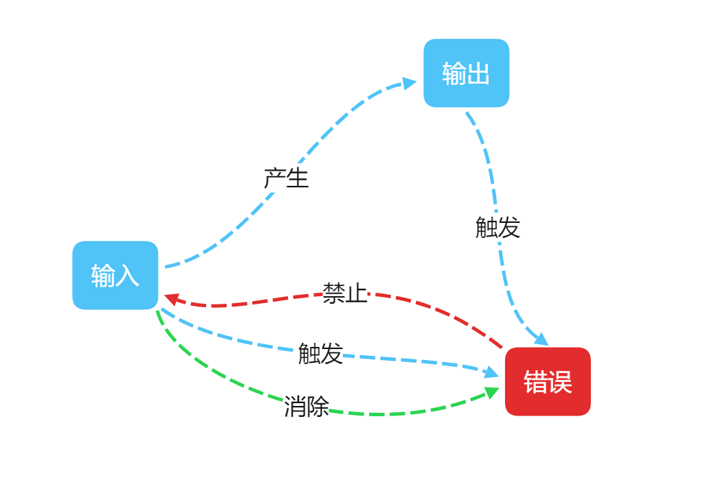

# TI程序员计算器程序文档

## 一、**软件系统分析和设计方案**

### 1、需求分析

#### 1）问题重述

**基本要求**：设计德州仪器程序员专用计算器（1977 年-1982 年发布）。按照TI程序员计算器（1982 年LCD版本）的原始面板键盘和显示布局设计出计算器的交互窗口，参照计算器的功能介绍，基本要求只需要实现10 进制和16 进制的基础算术运算。即不含括号的单步加减乘除运算。
**提高要求**：参照计算器的功能介绍，实现输入的 10 进制数和16 进制数之间的相互转换；实现与、或、异或、反码、补码和移位运算；实现单一进制模式下的带括号的组合多步运算；实现混合进制模式下带括号的组合多步运算；设计运算溢出等出错提示。

#### 2）需求分析综述

**使用java语言，运用java.swing界面设计技术，设计具有图形交互界面的，混合进制算数逻辑运算计算器的桌面应用程序。**

**界面需求分析**：按照TI程序员计算器说明书给出的参考图片，复刻计算器界面。

**交互需求分析**：通过用户**鼠标点击**图形交互界面按钮，输入运算的操作数和操作符。

**功能需求分析**：通过问题综述，可以看出基本要求中的功能要求是提高要求问题的子集，总体上可以用**混合进制算数逻辑运算**高度概括，具体需求如下：

1. 计算器具有8个数位的输入与输出
2. 16进制采用有符号数补码表示
3. 10进制以及16进制下算数运算（加减乘除）
4. 16进制下逻辑运算（与、或、异或、移位、求反码、求补码）
5. 10进制小数运算
6. 10进制16进制进制转换
7. 使用括号对运算顺序进行改变

**错误信号分析：**错误信号大体可以分为**溢出**和**语法错误**

| 序号 | 错误类型    | 错误信号变量名称   | 错误信号解释                   | 错误信号常量值 |
| ---- | ----------- | ------------------ | ------------------------------ | -------------- |
| 1    | OF/溢出     | INPUT_OVERFLOW     | 输入溢出                       | 5              |
| 2    | OF/溢出     | OUTPUT_OVERFLOW    | 输出溢出                       | 6              |
| 3    | GE/语法错误 | HEX_INPUT_WHEN_DEX | 在10进制情况下 输入a-f         | 3              |
| 4    | GE/语法错误 | SC1_WHEN_DEC       | 在10进制的时候使用反码按钮     | 8              |
| 5    | GE/语法错误 | SC2_WHEN_DEC       | 在10进制的时候使用补码按钮     | 9              |
| 6    | GE/语法错误 | AND_WHEN_DEC       | 在10进制的时候使用与运算按钮   | 12             |
| 7    | GE/语法错误 | OR_WHEN_DEC        | 在10进制的时候使用或运算按钮   | 13             |
| 8    | GE/语法错误 | XOR_WHEN_DEC       | 在10进制的时候使用异或运算按钮 | 14             |
| 9    | GE/语法错误 | SHE_WHEN_DEC       | 在10进制的时候使用移位按钮     | 15             |
| 10   | GE/语法错误 | INPUT_DOT_WHEN_HEX | 在16进制输入小数点             | 4              |
| 11   | GE/语法错误 | NEGATIVE_WHEN_HEX  | 在16进制状态下使用减号充当符号 | 11             |
| 12   | GE/语法错误 | MISS_PARENTHESES   | 缺少括号                       | 7              |
| 13   | GE/语法错误 | PARENTHESES_ERROR  | 括号使用的语法错误             | 10             |
| 14   | GE/语法错误 | EQUAL_ERROR        | 等号触发的多种错误             | 16             |
| 15   | GE/语法错误 | DIVIDE_ZERO        | 除以0                          | 17             |

### 2、功能及指标分析

对于上述需求分析，可以得到具体的功能及指标分析：

**界面及交互**：界面根据大作业要求必须使用**java.swing图形界面开发工具**进行编写，由于功能和实际TI程序员计算器相比略有删减，所以交互界面会有略微变化，但风格尽可能和实物保持一致。由于真实计算器是通过用户手动按下按钮进行输入，计算器通过液晶显示屏输出计算结果、状态信号以及错误信号，所以本软件只支持用户使用**鼠标点击**触发相关的**输入操作**。输出方面，按照真实计算器文档指标，可以输出8位数码。

**计算器核心功能**：

1. 由于输入输出的限制，计算器在**10进制**输入输出状态下支持**-9999999~99999999**的范围，**16进制**按照文档要求，可以输出等效二进制下**32位有符号数补码形式**，即正数**0~7FFFFFFF(0 ~ 2147483647)**；负数**80000000~FFFFFFFF(-2147483648 ~ -1)**。输入输出都有可能造成溢出，具体见**错误信号分析**部分。十进制可以使用负号（-）表示负数，十六进制使用符号位表示正负（以下不再区分正数负数）。
2. 10进制支持**整数、小数**的**加减乘除**运算，可以使用**括号**调整计算顺序。
3. 16进制只支持**整数**的**加减乘除**算术运算，以及逻辑运算**与、或、异或、移位、求反码、求补码**运算，可以使用**括号**对算数运算和逻辑运算（除求反码、求补码）的计算顺序进行调整。
4. 计算器支持10进制和16进制之间的**进制转换**，一个计算表达式可以是**混合进制输入**（混合进制包括了单一进制）

| 序号 | 符号 | 说明     |
| ---- | ---- | -------- |
| 1    | +    | 算数加   |
| 2    | -    | 算数减   |
| 3    | *    | 算数乘   |
| 4    | /    | 算数除   |
| 5    | &    | 逻辑与   |
| 6    | \|   | 逻辑或   |
| 7    | ^    | 逻辑异或 |
| 8    | <    | 逻辑移位 |
| 9    | =    | 等号     |
| 10   | 1'SC | 求反码   |
| 11   | 2'SC | 求补码   |

**错误信号**

由于输入输出限制，以及算数逻辑表达式的相关语法。

计算器可能会因为用户的非法输入产生**溢出类型错误**以及**语法错误**，如：输入溢出、10进制状态下使用十六进制补充操作数……

由于表达式的计算还可能产生如：输出溢出、除以0……等溢出类型错误和语法错误。

当错误信号**触发**，应该有相关信号展示，并且禁止用户的后续输入，只有当错误信号**消除**，才可以继续输入。

### 3、系统设计方案

**界面设计方案**：

**交互设计方案**：

**核心功能设计方案：**

**错误触发及消除设计方案**：

## 二、**软件实现和代码编写**

### 1、用户输入模块与实践处理

### 2、错误信号触发与消除机制

### 3、算法模块

算法模块具体见**算法分析**部分

## 三、**算法分析**

### 1、计算器计算算法分析

### 2、进制转换算法分析

### 3、反码、补码算法分析

## 四、**软件调试和测试**

### 1、软件测试

### 2、问题与解决方案

## 五、**参考文献和材料**

## 六、**团队成员姓名和联系方法**

**张宸冉**	邮箱：1604690196@qq.com	Github:Mr-Talon	

负责内容：图形交互界面设计，输入逻辑设计与异常输入拦截，项目统筹，文档图形交互界面、输入逻辑、错误信号部分

**梁涛**		邮箱：332604872@qq.com	  Github:3dfish2dweb

负责内容：计算器计算算法设计，文档计算器算法设计、分析、测试部分

**杨德宝**	邮箱：2495499315@qq.com	Github:Lyr3

负责内容：计算器进制转换算法设计，文档进制转换算法设计、分析、测试部分

**佘振东**	邮箱：2577484662@.qq.com	Github:fsbbts

负责内容：计算器反码补码算法设计，文档反码补码算法设计、分析、测试部分