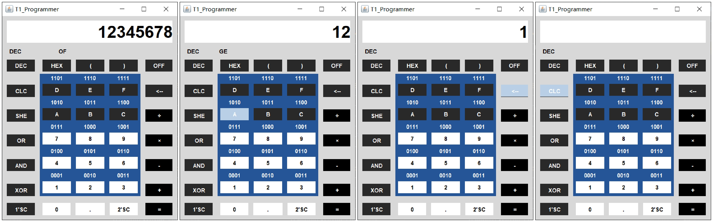
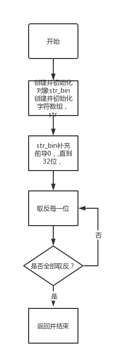
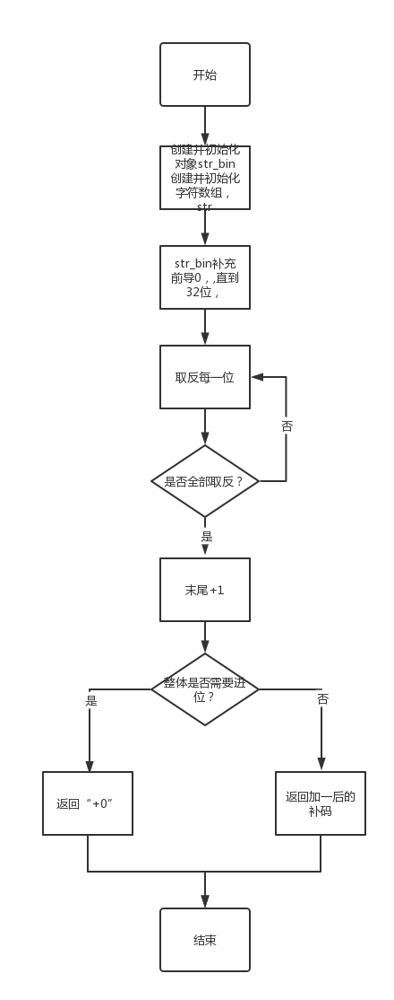
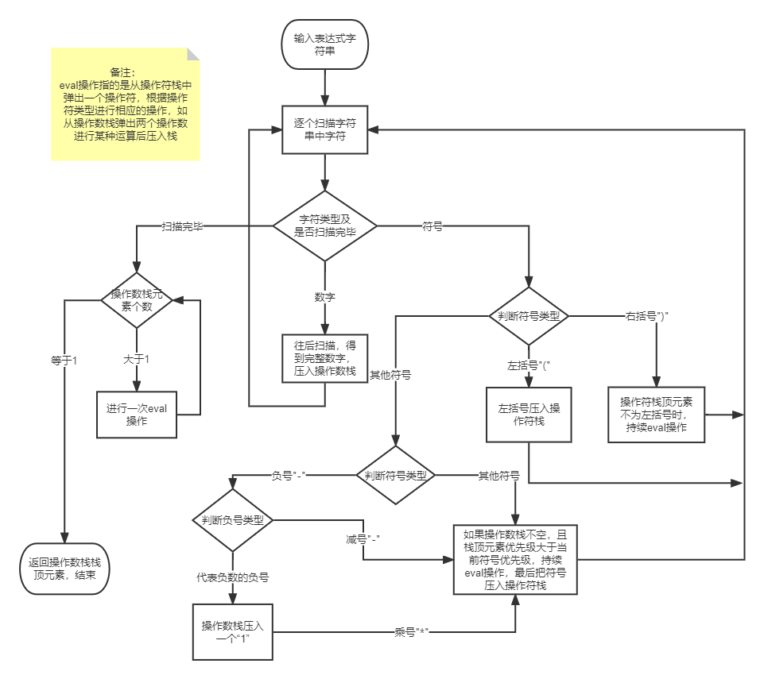

# TI程序员计算器程序文档

## 一、**软件系统分析和设计方案**

### 1、需求分析

#### 1）问题重述

**基本要求**：设计德州仪器程序员专用计算器（1977 年-1982 年发布）。按照TI程序员计算器（1982 年LCD版本）的原始面板键盘和显示布局设计出计算器的交互窗口，参照计算器的功能介绍，基本要求只需要实现10 进制和16 进制的基础算术运算。即不含括号的单步加减乘除运算。
**提高要求**：参照计算器的功能介绍，实现输入的 10 进制数和16 进制数之间的相互转换；实现与、或、异或、反码、补码和移位运算；实现单一进制模式下的带括号的组合多步运算；实现混合进制模式下带括号的组合多步运算；设计运算溢出等出错提示。


#### 2）需求分析综述

**使用java语言，运用java.swing界面设计技术，设计具有图形交互界面的，混合进制算数逻辑运算计算器的桌面应用程序。**

------

**界面需求分析**：按照TI程序员计算器说明书给出的参考图片，复刻计算器界面。

**交互需求分析**：通过用户**鼠标点击**图形交互界面按钮，输入运算的操作数和操作符。

**功能需求分析**：通过问题综述，可以看出基本要求中的功能要求是提高要求问题的子集，总体上可以用**混合进制算数逻辑运算**高度概括，具体需求如下：

1. 计算器具有8个数位的输入与输出
2. 16进制采用有符号数补码表示
3. 10进制以及16进制下算数运算（加减乘除）
4. 16进制下逻辑运算（与、或、异或、移位、求反码、求补码）
5. 10进制小数运算
6. 10进制16进制进制转换
7. 使用括号对运算顺序进行改变
8. 10进制16进制混合计算

**错误信号分析：**错误信号大体可以分为**溢出**和**语法错误**

| 序号 | 错误类型    | 错误信号变量名称   | 错误信号解释                   | 错误信号常量值 |
| ---- | ----------- | ------------------ | ------------------------------ | -------------- |
| 1    | OF/溢出     | INPUT_OVERFLOW     | 输入溢出                       | 5              |
| 2    | OF/溢出     | OUTPUT_OVERFLOW    | 输出溢出                       | 6              |
| 3    | GE/语法错误 | HEX_INPUT_WHEN_DEX | 在10进制情况下 输入a-f         | 3              |
| 4    | GE/语法错误 | SC1_WHEN_DEC       | 在10进制的时候使用反码按钮     | 8              |
| 5    | GE/语法错误 | SC2_WHEN_DEC       | 在10进制的时候使用补码按钮     | 9              |
| 6    | GE/语法错误 | AND_WHEN_DEC       | 在10进制的时候使用与运算按钮   | 12             |
| 7    | GE/语法错误 | OR_WHEN_DEC        | 在10进制的时候使用或运算按钮   | 13             |
| 8    | GE/语法错误 | XOR_WHEN_DEC       | 在10进制的时候使用异或运算按钮 | 14             |
| 9    | GE/语法错误 | SHE_WHEN_DEC       | 在10进制的时候使用移位按钮     | 15             |
| 10   | GE/语法错误 | INPUT_DOT_WHEN_HEX | 在16进制输入小数点             | 4              |
| 11   | GE/语法错误 | NEGATIVE_WHEN_HEX  | 在16进制状态下使用减号充当符号 | 11             |
| 12   | GE/语法错误 | MISS_PARENTHESES   | 缺少括号                       | 7              |
| 13   | GE/语法错误 | PARENTHESES_ERROR  | 括号使用的语法错误             | 10             |
| 14   | GE/语法错误 | EQUAL_ERROR        | 等号触发的多种错误             | 16             |
| 15   | GE/语法错误 | DIVIDE_ZERO        | 除以0                          | 17             |


### 2、功能及指标分析

对于上述需求分析，可以得到具体的功能及指标分析：

#### **1）界面及交互**

界面根据大作业要求必须使用**java.swing图形界面开发工具**进行编写，由于功能和实际TI程序员计算器相比略有删减，所以交互界面会有略微变化，但风格尽可能和实物保持一致。由于真实计算器是通过用户手动按下按钮进行输入，计算器通过液晶显示屏输出计算结果、状态信号以及错误信号，所以本软件只支持用户使用**鼠标点击**触发相关的**输入操作**。输出方面，按照真实计算器文档指标，可以输出8位数码。

#### **2）计算器核心功能**

1. 由于输入输出的限制，计算器在**10进制**输入输出状态下支持$-9999999 - 99999999$的范围，**16进制**按照文档要求，可以输出等效二进制下**32位有符号数补码形式**，即正数$0 - 7FFFFFFF(0 - 2147483647)$；

   负数$80000000 - FFFFFFFF(-2147483648  - -1)$。输入输出都有可能造成溢出，具体见**错误信号分析**部分。十进制可以使用负号（-）表示负数，十六进制使用符号位表示正负（以下不再区分正数负数）。

2. 10进制支持**整数、小数**的**加减乘除**运算，可以使用**括号**调整计算顺序。

3. 16进制只支持**整数**的**加减乘除**算术运算，以及逻辑运算**与、或、异或、移位、求反码、求补码**运算，可以使用**括号**对算数运算和逻辑运算（除求反码、求补码）的计算顺序进行调整。

4. 计算器支持10进制和16进制之间的**进制转换**，一个计算表达式可以是**混合进制输入**（混合进制包括了单一进制）。

| 序号 | 符号 | 说明     |
| ---- | ---- | -------- |
| 1    | +    | 算数加   |
| 2    | -    | 算数减   |
| 3    | *    | 算数乘   |
| 4    | /    | 算数除   |
| 5    | &    | 逻辑与   |
| 6    | \|   | 逻辑或   |
| 7    | ^    | 逻辑异或 |
| 8    | <    | 逻辑移位 |
| 9    | =    | 等号     |
| 10   | 1'SC | 求反码   |
| 11   | 2'SC | 求补码   |

#### **3）错误信号**

由于输入输出限制，以及算数逻辑表达式的相关语法。

计算器可能会因为用户的非法输入产生**溢出类型错误**以及**语法错误**，如：输入溢出、10进制状态下使用十六进制补充操作数……

由于表达式的计算还可能产生如：输出溢出、除以0……等溢出类型错误和语法错误。

当错误信号**触发**，应该有相关信号展示，并且禁止用户的后续输入，只有当错误信号**消除**，才可以继续输入。


### 3、系统设计方案

#### 1）软件架构

项目代码主要分为交互和事件处理部分以及三个核心算法。主类创建在交互和事件处理类T1_Programmer中，中间需要使用进制转换、计算、取反码补码的算法只需要调用相关算法类的**静态方法**，或者是在T1_Programmer类的事件处理方法中创建算法类的**匿名内部类**调用相关方法实现对话。能够实现这一操作得益于java的**包管理机制**，由于所有类都创建在项目包内，所以可以不受限制的相互调用。这样做能够将事件处理、算法编写分离，便于分工协作，每个人只需要知道自己会从上游获得什么，需要输出什么，不必要对小组其他成员代码的细节有详细了解，实现每个人工作的松耦合。


#### **2）界面设计方案**

java.swing界面设计方案可以通过直接编写代码完成，也可以使用集成开发环境中的java swing GUI设计工具包完成。对于课程学习，掌握swing类的继承关系，类的方法和属性，直接编写代码更加合适。对于工程项目，大量的交互组件和互相包含的容器组合，使用快速开发工具更加准确和方便。

对于本次项目，总共有35个按钮，4个信号输出位置，以及一个表达式输出窗口。组件繁多，容器互相嵌套，布局要求非常工整。所以选择了IDEA集成开发环境内置的**swing UI设计器**中的GUI窗体设计功能。

该功能类似Android开发中编写布局XML文件，只不过这里省去了对XML代码的直接编写，使用拖拽的方式进行布局。GUI窗体设计工具产生的.form文件是**XML资源文件**，里面使用了XML标签对象的格式对所有窗体、组件的布局等属性进行了标记。编写程序主类的时候会关联解析布局资源文件，按照布局的要求显示图形交互界面。


上图为GUI窗体工具包中的最终设计面板，下图为主要的容器嵌套树形关系


在窗体中首先新建一个根容器root，分析可知，整个计算器可以分成三个大模块，从上到下依次为：**显示模块、信号显示模块、用户输入模块**。对于root根容器，使用GridLayoutManager对其进行布局。**GridLayoutManager**是IDEA集成开发环境推荐的布局管理方式，对于多行多列的表格形图形交互界面有很好的效果。

**显示模块**，整个模块使用一个JPanel封装，设置背景颜色background为白色。使用的组件是JLabel，用字符串的形式显示用户的输入和计算器的输出，可以在JLabel属性中设置horizontal size policy水平大小许可、font字体格式、foreground前景颜色（字体颜色）、以及JLabel类的类名。这里采用黑色作为字体颜色，水平大小可收缩、可增大。同时使用了一个水平分隔，放置在JLabel左侧，可以让不同位数的字符串始终出现在显示模块右侧。


**信号显示模块**，和显示模块类似，总共有4个JLabel，分别对应了10进制状态DEC、16进制状态HEX、溢出错误OF以及语法错误GE。由于需要在一行显示，这里整个信号显示模块的JPanel使用的是**FLowLayout**布局管理，设置属性horizontal align水平对齐方式为左侧对齐。对于四个信号，默认初始显示DEC，其他三个变量使用空格填充。如果使用setVisible属性设置，会导致全部左对齐，和真实硬件场景不符。


**用户输入模块**，对比原产品照片和当前软件需求可以知道，输入模块的按钮可以按照一个7*5的表格排列，但是中间的15位输入部分，背景颜色较为特殊，并且按钮上方有16进制对应的2进制编码，方便用户直接将16进制输出转换为2进制格式。

所以对于整个表格容器，选择GridLayoutManager作为布局管理，建立7*5的表格。合并中间5 * 3的表格，并且在其中嵌套一个JPanel，此嵌套JPanel同样是用GridLayoutManager作为布局管理，建立5*3的表格。中间的15个表格单元，再嵌套一个JPanel，同样使用GridLayoutManager作为布局管理，设置上下两行，上面一行放置一个JLabel作为二进制提示文本，下面一行放置一个JButton按钮，作为用户输入的焦点。5 * 3的表格外，其他表格单元按照排版要求放置相应的JButton，同时在需要的地方增加垂直分隔，以满足排版的美观。

对于35个按钮，都在其属性栏设置相应的对象名，设置了对象名的组件，集成开发环境会在主类代码中创建对象的私有成员，方便后续的事件处理。同时给按钮设置了默认显示文字，对应了真实计算器上按键的铭文。按照排版需求设置相应容器和按钮的背景颜色和前景文字颜色。为了交互的美观，对所有的JButton，取消勾选了borderPainted、focusCycleRoot、focusPainted、focusable等属性，使得点击按钮没有焦点框，阴影效果已经描边，让整体交互更加优雅。


**最终成品图形交互界面截图如下：**


#### 3）**交互设计方案**

用户输入统一使用对按钮的**高级事件处理**，即点击按钮触发**输入**，用户输入会在显示模块显示，每次显示一个操作数或者是左右括号。每当用户输入一个操作符或者是左右括号，表示上一个操作数输入完毕。这样设计符合数学上算术逻辑表达式的语法，符合TI程序员计算器的说明文档，也符合当前市面上主流的计算器交互逻辑。同时我们增加了两个功能，**回退**按钮“<--”和**清空**按钮“CLC”，更加方便用户对当前输入进行修改。

当所有表达式输入完毕，用户点击**等号**，计算器在显示模块返回**输出**结果。

对于**取反码**和**取补码**这两个特殊的逻辑运算，按下后会立即对表达式进行重写，直接在显示模块反馈给用户。

当然，用户会由于操作失误导致错误输入，错误输入主要分为两大类型。一种是**溢出错误**，即用户输入了超过输入允许范围的操作数，或者是用户正确输入的计算结果超出了计算器正确的表示范围。另一种错误是**语法错误**，由于本计算器涉及到不同进制下的混合计算，很多操作符和操作数都有相应的使用范围，加上括号的引入以及传统的表达式语法错误。本计算器可能会收到相当多的用户错误输入，对于非致命错误，计算器会屏蔽对输入的响应，但是不会产生错误信号；对于致命的错误，有可能会使得计算器核心算法不能正确运行，计算器会给出错误信号，只有当用户消除了所有错误信号，才可以继续输入。

**这样将纷繁复杂是防止用户错误输入的工作交由事件处理解决，既符合了错误的产生和消除逻辑，又可以让算法设计在相对理想的环境下完成。**

#### **4）核心功能设计方案**

##### **混合进制计算器的输入方案**

由于计算器对用户输入操作数的个数没有限制，软件无法确定用户输入的个数，所以使用数组等方案记录操作数和操作符不是明智的选择。本软件所有的用户输入，在软件底层都会转化成字符串形式，为此定义了两个临时的字符串变量：

```java
    private String expression="";   //总表达式
    private String currentString="";   //当前需要展示在JLabel ans上字符串
```

currentString记录**当前的操作数**，expression记录**总表达式**。

根据需求分析，我们知道该计算器在一个表达式中的不同操作数可能来自不同的数制。例如我们可以输入这样的表达式：$123_{10}+2BC_{16}+123_{16}$，根据计算机组成原理以及数字电路对于数制的介绍，我们可以知道，不同的数制只是对于数的展示形式的不同，计算的结果都是等效的。所以所有16进制模式下输入的16进制数，都会在软件底层通过调用**16进制转10进制**的方法将16进制对应的10进制操作数输入到总表达式中。这样计算器算法只需要处理10进制下的操作。（具体算法分析见**软件实现和代码编写**）

```java
currentString=new Translation(currentString).Decimal();
expression+=currentString;
```

我们知道，当表达式可以看做操作数和操作符的集合，除括号外，两个操作符之间是操作数的范围。可以根据这一语法特性设置用户输入方案。

1. 对于**1-9**，允许出现在10进制和16进制两个状态下。分析所有可能的前缀，**1）**前缀是左括号表示当前是左括号后第一个操作数，应该将左括号加入总表达式，清空当前表达式，并将当前字符输入。**2）**前缀是右括号，则产生了语法错误，但不是致命错误，计算器不会做出响应。**3）**前缀是操作符的情况请见操作符部分的分析。**4）**前缀是其他操作数的内容，则在当前表达式末尾追加当前字符。
2. 对于**A-F**，只允许出现在16进制状态下。其他情况和1-9完全一样。
3. 对于**0**，允许出现在10进制和16进制两个状态下。**1）**0作为当前操作数的开头字符，只有在输入小数的情况下可以出现，并且不可能出现多个0重复出现在开头的情况，这是语法错误，但是不是致命的，多次重复在操作数开头输入0计算器不会做出响应。**2）**其他情况和1-9完全一样。
4. 对于**小数点**，只允许出现在10进制模式下，分析所有可能的前缀，**1）**当前操作数为空的时候不可以用小数点作为操作数的第一个字符，这是严格意义上的数学表达式格式，也方便算法的设计。**2）**当前操作数中，已经出现了小数点，就不可以再次输入小数点，这是语法错误，但不致命，计算器不会做出响应。**3）**其他情况和1-9完全一样。
5. 对于**左括号**，允许出现在10进制和16进制模式下，分析所有可能前缀，**1)**前缀是左括号，是嵌套使用括号的情况，将前一个左括号加入总表达式，将当前表达式清空并加入新的左括号。**2）**前缀是右括号，是语法错误，会触发错误信号。**3）**前缀是操作数（包括小数点），也是语法错误，会触发错误信号。**4）**前缀是操作符见操作符部分的分析。
6. 对于**右括号**， 允许出现在10进制和16进制模式下，**1）**前缀是左括号，说明括号内为空，是语法错误，会触发错误信号。**2）**前缀是右括号，说明是嵌套使用括号的情况，将前一个右括号加入总表达式，将当前表达式清空并加入新的右括号。**3）**前缀是操作符，说明表达式缺少操作数，是语法错误，会触发错误信号。**4）**前缀是操作数，这里需要区分两种情况，一种是操作数是10进制输入模式，直接将操作数加入总表达式，清空当前表达式，将右括号加入当前表达式。另一种是16进制输入模式，由于算法设计，这里需要先将16进制操作数转换成10进制操作数，其他后续操作和10进制一样。
7. 对于**10进制按钮**，允许在10进制和16进制模式下使用，**1）**10进制模式没有效果。**2）**16进制模式下，如果当前表达式不是括号，就需要调用16进制转10进制函数实现进制转换，将转换结果更新当前表达式。由于16进制转换过来的数可能是负数，对于出现负数的情况，会在后台加入括号，防止计算算法出现错误。
8. 对于**16进制按钮**，允许在10进制和16进制模式下使用，所有的逻辑和10进制按钮对称。
9. 对于**回退按钮**，允许在10进制和16进制模式下使用，作用是删除当前表达式末尾的一个字符，同时还会对错误信号产生影响，具体见错误触发及消除设计方案。
10. 对于**清空按钮**，允许在10进制和16进制模式下使用，作用是删除当前表达式和总表达式，同时还会对错误信号产生影响，具体见错误触发及消除设计方案。
11. 对于**加、乘、除**，允许在10进制和16进制模式下使用，分析所有可能的前缀，**1）**当总表达式为空，操作符除了负号不应该出现在总表达式的最前端，是语法错误，但是不是致命错误，计算器不会给出响应。**2）**前缀是左括号，是语法错误，触发错误信号。**3）**前缀是右括号，将右括号加入总表达式，清空当前表达式，并且将当前符号加入总表达式。**4）**前缀是操作数，和右括号处理前缀是操作数的逻辑相同。**5）**前缀是操作符，语法错误，但是不是致命错误，计算器不会做出响应。
12. 对于**与、或、异或、移位**，允许在16进制模式下使用，逻辑和加、乘、除相同。
13. 对于**减号**，允许在10进制和16进制模式下使用。**1）**10进制模式下，如果出现在当前表达式开头或者是左括号之后，可以当做负号使用。将符号输入在当前表达式中。**2）**16进制模式下，由于16进制使用有符号数补码表示，最高位是符号位，所以不允许在当前表达式开头或者是左括号之后出现符号，这是语法错误，会触发错误信号。**3）**充当减号使用的时候逻辑和其他操作符一致。
14. 对于**求反码和补码**，允许在16进制模式下使用，可以将当前16进制码转换成对应的反码或者补码的形式，并且展现在显示模块。
15. 对于**等号**，是表达式输入完毕的标志，首先会对表达式中间的可能出现的错误进行判别，并且返回相应的错误信号。（具体见错误触发及消除设计方案）**1）**当前输入状态是10进制，首先会把当前表达式加入总表达式，调用计算方法，得到结果，判断是否溢出，如果溢出返回溢出信号。由于存在除法，会产生无限小数，这种溢出只是长度上的溢出，并不是大小上的溢出，所以还要对小数进行四舍五入。**2）**当前输入状态是16进制，首先是和其他操作符一样，对输入进行进制转换，得到最终的总表达式。对于除法，可能会出现小数结果，但是16进制模式下不可以出现小数点，此时计算器会自动转换到10进制模式，其他小数的处理逻辑和10进制一致。
16. 对于**关闭按钮**，和图形界面的关闭按钮功能一致。

##### **计算器计算算法**

对于计算机来说，后缀表达式更方便计算，而中缀表达式对于人来说更加直观。显然，人操作计算器，输入的是中缀表达式（infix expression）。所以，我们的计算类Calculator提供了一个静态方法`public static String compute(String infixExpression)`，接收一个中缀表达式字符串，经过一系列计算，返回一个结果字符串。

在实现计算的过程中，如果过程量出现一个数除以0的情况，会抛出算数运算异常`ArithmeticException`；此外，如果输入的表达式不符合中缀表达式的规范，导致计算过程中出现了一些操作数与操作符个数不符的情况，会抛出空指针异常`NullPointerException`。

##### **进制转换方案**

进制转换需要完成十进制与十六进制的互相转换，为此实现类Translation,并定义方法Decimal()实现十六进制转十进制，方法Hexadecimal()实现十进制转十六进制。由于在软件设计中，所有的用户输入都将被保存为字符串形式，因此声明String类型成员s存放上游传来字符串。此外，在进制转换过程中不考虑用户的错误输入及计算溢出，所有可能导致输出错误的在上游和返回结果后判断。此外，十六进制在该计算器中是以补码的形式存在，为了处理负数的互相转换，创建新类BintoHex，该类实现了十六进制字符串与二进制字节数组的互相转换。

**十六进制转换十进制**，由于补码的特性，十六进制字符串正数负数转换的方法不一致，需要对字符串进行判断。

1.**字符串长度小于8**，调用Long.parseLong方法直接获得十六进制代表的十进制正数，并返回十进制字符串

2**.字符串长度等于8且首字符大于’7‘**，调用调用BintoHEX方法获得二进制字符数组方法，再调用BigInteger直接获得二进制字符串代表的十进制负数，并返回十进制字符串。

3.**字符串长度等于8且首字符小于’7’**，调用Long.parseLong方法直接获得十六进制代表的十进制正数，并返回十进制字符串。

**十进制转换十六进制**，首先调用BigInteger方法获取十进制对应二进制数组，然后用二进制数组调用静态方法bin2HexStr获取对应十六进制字符串并返回。在测试结果的过程中，发现了一些错误，并给出相应的处理办法。

1.**无法返回十进制1-16对应的十六进制**，单独判断这种情况，直接调用Integer.toHexString方法返回对应字符串

2.**十六进制负数字符串存在缺省F**，判断返回字符串长度及二进制字节数组首字符，当十六进制为负数时，补齐F并返回修改后的字符串。

3.**返回字符串存在前缀'0'不缺省**，判断返回字符串并将再次循环判断去零字符串，直至字符串不含前缀'0'. 

##### **反码补码方案**

**转反码：**TI计算器有效位数的字符串：调用BintoHex类中的hexStr2BinStr方法转为2进制字符串，再补成32位，进行取反操作，Translation类新建对象，用以返回取反后的16进制。

**转补码：**由于补码是由反码末尾+1，所以先转为反码，与之前的一致。


#### **5）错误触发及消除设计方案**

错误都是通过用户的输入或者是计算造成的，而且计算器的错误繁多，因此将错误的处理机制写在每一个按钮的事件处理里面，可以很好的进行分析，做到尽可能没有遗漏。

对于非致命的错误，计算器不会做出响应，这一部分已经在**核心功能设计方案-混合进制计算器的输入方案**中陈述。以下只讨论会触发错误信号的错误的触发和消除。

**触发**：

1. **0-9**，当输入的位数超过了8位，就会引起输入溢出错误INPUT_OVERFLOW。
2. **A-F**，输入状态是10进制，会引起语法错误HEX_INPUT_WHEN_DEX，同时和0-9一样也会引输入溢出错误INPUT_OVERFLOW。
3. **小数点**，16进制下不可以输入小数，会引起语法错误INPUT_DOT_WHEN_HEX，溢出同上。
4. **左括号**，左括号前面是右括号或者是操作数会引起语法错误PARENTHESES_ERROR。
5. **右括号**，右括号前面是左括号或者是其他操作符会引起语法错误PARENTHESES_ERROR。
6. **十进制按钮**，16进制转10进制可能会溢出，触发输出溢出错误OUTPUT_OVERFLOW。
7. **十六进制按钮**，十进制小数无法转换成16进制，会产生语法错误INPUT_DOT_WHEN_HEX。
8. **加号乘号除号**，加号乘号除号前面是左括号会产生语法错误PARENTHESES_ERROR。
9. **减号**，减号在16进制状态充当负号使用会触发语法错误NEGATIVE_WHEN_HEX。
10. **与或异或移位**，除了和加乘除一样不可以在左括号后使用，还不可以在10进制模式下使用，会产生AND_WHEN_DEC、OR_WHEN_DEC、XOR_WHEN_DEC、SHE_WHEN_DEC。
11. **取反码补码**，在10进制使用，会产生语法错误SC1_WHEN_DEC、SC1_WHEN_DEC、SC2_WHEN_DEC.
12. **等号**，总表达式左右括号数量不一致，产生语法错误MISS_PARENTHESES；表达式最后是左括号，产生语法错误PARENTHESES_ERROR；表达式最后是操作符，产生语法错误EQUAL_ERROR；收到算法抛出的除以0的异常，产生语法错误DIVIDE_ZERO；输出结果溢出，产生溢出错误OUTPUT_OVERFLOW。

**消除**

1. **十进制按钮**，16进制输入小数点产生的错误回到10进制应该消除。
2. **十六进制按钮**，10进制输入16进制操作数、10进制使用取反码、补码按钮产生的错误转换到16进制应该被消除。
3. **回退按钮**，通过回退按钮使得当前输入文本没有溢出就将溢出信号去除；16进制模式下输入了小数点或者是10进制小数转换成16进制产生的错误，如果表达式中小数点已经消除，该错误信号应该消除；10进制情况下输入了ABCDEF可以通过删除ABCDEF去除语法错误；此外通过回退按钮使得当前输入文本清空直接清除所有错误。
4. **清空按钮**，所有溢出错误、语法错误都会消除。



上图从左到右分别展示了，溢出错误，语法错误，用回退按钮消除错误以及用清空按钮消除错误。


## 二、**软件实现和代码编写**

### 1、用户输入模块与事件处理

用户输入模块的逻辑简单，只是种类繁多，对于不同的按钮有不同的处理方法，下面列举具有代表性的按钮，在注释的帮助下不难理解代码的含义。

#### 1）操作数输入（以0和A为例）

```java
/*操作数0*/
a0Button.addActionListener(new ActionListener() {
            @Override
            public void actionPerformed(ActionEvent e) {    //按钮0需要防止过多的0输入
                //表达式开头只有在小数点输入的时候可以是0，而且这个时候0一定是字符串的首个元素  如果第一个元素输入了0，第二个元素输入小数点
                //就不会进入return的分支，因为此时字符串长度已经等于2
                //只有在开头连续输入0 才是不被允许的 这里不返回错误信号  指示不允许用户这么输入
                if (error==0){                             //有错误无法输入
                    if (currentString.length()<8){         //没有溢出 正常进行
                        if(currentString.length()==1&&currentString.charAt(0) == '0'){
                            return;                        //当前字符串长度是1 并且输入的操作数是0  就造成了重复输入0
                        }
                        if(currentString.contains(")")){   //右括号后不可以是操作数
                            return;
                        }
                        if (currentString.contains("(")){  //由于括号也会显示  所有的操作数会作为括号的结束条件  将括号加入总表达式
                            expression+=currentString;
                            currentString="";
                        }
                        String text="0";
                        currentString+=text;
                        ans.setText(currentString);
                    }
                    else {
                        error=INPUT_OVERFLOW;              //内部错误信号
                        overflowError.setText("OF");       //计算器界面显示溢出错误
                    }
                }
            }
        });

/*操作数A 只展示部分代码*/
if (state==DEC){                    //对于a-f的字符 只能在16进制输入状态下输入
    error=HEX_INPUT_WHEN_DEX;
    grammarError.setText("GE");
}
else {                              //正确输入情况
    if (currentString.contains("(")){
        expression+=currentString;
        currentString="";
    }
    String text=aButton.getText();
    currentString+=text;
    ans.setText(currentString);
}
                    
```

#### 2）操作符输入（以减号为例）

```java
MinusButton.addActionListener(new ActionListener() {
            @Override
            public void actionPerformed(ActionEvent e) {
                //减号前面只可能是左括号和右括号或者是数字  10进制情况下可以用减号表示负数
                if (error==0){
                    if (state==DEC){
                        if (expression.length()==0&&currentString==""){
                            //减号用作负号 要么是表达式的第一项 要么就是左括号之后
                            String text="-";
                            currentString=text;         //用作负号直接加入当前表达式
                            ans.setText(currentString);
                        }
                        //在左括号之后
                        else if (currentString.contains("(")){
                            expression+=currentString;
                            currentString="-";
                            ans.setText(currentString);
                        }
                        //用作减号的情况
                        else {
                            expression+=currentString;   //操作符需要将之前一个操作数放入总表达式
                            currentString="";
                            ans.setText(currentString);
                        }

                    }
                    else {
                        //16进制情况下 不允许输入减号作为负号
                        if ((expression.length()==0&&currentString=="")||currentString.contains("(")){
                            error=NEGATIVE_WHEN_HEX;
                            grammarError.setText("GE");
                            return;
                        }
                        if (!currentString.contains(")")){
                            currentString=new Translation(currentString).Decimal();  
                            //16进制将当前表达式加入总表达式需要先转换成10进制
                            expression+=currentString;
                            currentString="";
                            ans.setText(currentString);
                        }
                        else{
                            //右括号直接加入总表达式
                            expression+=currentString;
                            currentString="";
                            ans.setText(currentString);
                        }
                    }
                    if (!Objects.equals(expression, "")){   //由于减号可以作为负号出现在总表达式的第一个字符 所以增加了这个判断
                        String lastCharE=expression.substring(expression.length()-1);
                        if (notContainSymbol(lastCharE)&&!currentString.contains("-")){
                            expression+="-";        //最后jia
                        }
                    }
                }
            }
        });
```

#### 3）括号输入（以右括号为例）

```java
RightButton.addActionListener(new ActionListener() {
            @Override
            public void actionPerformed(ActionEvent e) {
                //右括号前面只可能是 右括号或者是操作数
                if (error==0){
                    if (!notContainSymbol(currentString.substring(1))||currentString.contains("(")){ 
                        error=PARENTHESES_ERROR;                //右括号前面是左括号或者是其他操作符  语法错误
                        grammarError.setText("GE");
                    }
                    if (!currentString.contains(")")){
                        if (state==DEC){
                            expression+=currentString;          //右括号和左括号不同 左括号可以理解为一个字符 右括号需要理解为一个操作符
                            currentString="";                   //输入有操作符 代表前一个操作数的结束  需要把操作数置入总表达式
                        }
                        else if (state==HEX){
                            String temp=new Translation(currentString).Decimal();
                            expression+=temp;                   //16机制下需要转换成10进制才能加入表达式
                            currentString="";
                            ans.setText(currentString);
                        }
                    }
                    else {                                       //前面的操作数是右括号  嵌套括号
                        expression+=currentString;
                        currentString="";
                    }
                    String text=")";
                    currentString+=text;
                    ans.setText(currentString);
                    numOfRightParentheses++;
                }
            }
        });
```

#### 4）等号

```java
EqualButton.addActionListener(new ActionListener() {
            @Override
            public void actionPerformed(ActionEvent e) {
                //等号前面可以是 右括号 操作数   不能是左括号 操作符
                if(error==0){
                    if (numOfRightParentheses!=numOfLeftParentheses){     //处理少括号的语法错误
                        error=MISS_PARENTHESES;
                        grammarError.setText("GE");
                        return;
                    }
                    if (currentString.contains("(")){     			      //括号前面是左括号运算没有结束 错误
                        error=PARENTHESES_ERROR;
                        grammarError.setText("GE");
                        return;
                    }
                    if (!notContainSymbol(expression.substring(expression.length()-1))&&currentString==""){  
                        //等号前面不可以是操作符
                        error=EQUAL_ERROR;
                        grammarError.setText("GE");
                        return;
                    }

                    //16进制走这条分支
                    if (state==HEX){
                        if (!currentString.contains(")")){                //前面可能是右括号 或者是操作数   此分支处理操作数的情况
                            currentString=new Translation(currentString).Decimal();
                            expression+=currentString;
                        }
                        else{                                             //此分支 前面是括号 不需要转换成10进制 直接加入总表达式
                            expression+=currentString;
                        }

                        System.out.println("cal前："+expression);
                        try{
                            currentString=Calculator.compute(expression); //计算结果返回一个字符串  10进制
                        }
                        catch (ArithmeticException exception){            //算法会抛出除以0的异常对象
                            error=DIVIDE_ZERO;
                            grammarError.setText("GE");
                            return;
                        }
                        System.out.println("cal后："+currentString);

                        //16进制后处理
                        BigDecimal Up = BigDecimal.valueOf(2147483647);    //16进制上界
                        BigDecimal Down = BigDecimal.valueOf(-2147483648); //16进制下界
                        BigDecimal tempAns1 =BigDecimal.valueOf(Double.parseDouble(currentString));
                        if (tempAns1.compareTo(Up) < 0 && tempAns1.compareTo(Down) > 0){//判断是否溢出
                            if(currentString.contains(".")){
                                //计算结果有小数  只有16进制除法会遇到这种情况  自动转换成10进制模式
                                state=DEC;
                                DECState.setText("DEC");
                                HEXState.setText("         ");
                                if (currentString.length()>9){             //对于无限小数（除法运算会产生）
                                    //以下是四舍五入算法
                                    int point=currentString.indexOf(".");  //获取表达式小数点位置
                                    int need_to_left=8-point-1;            //计算小数点后需要保留的位数
                                    tempAns1=BigDecimal.valueOf(Double.parseDouble(currentString.substring(0,8)));
                                    if (Integer.parseInt(currentString.substring(7,8)) >=5){   
                                        //根据返回字符串的第九位判断是否需要四舍五入
                                        String plus="0.";
                                        for(int i=0;i<need_to_left-1;i++){
                                            plus+="0";
                                        }
                                        plus+="1";                         //制造一个五入的小数
                                        Double plusNum=Double.parseDouble(plus);
                                        tempAns1=tempAns1.add(BigDecimal.valueOf(plusNum));
                                        ans.setText(tempAns1.stripTrailingZeros().toPlainString());
                                        expression="";
                                    }
                                    else {                                 //不需要四舍五入直接截取字符串
                                        ans.setText(tempAns1.stripTrailingZeros().toPlainString());
                                        expression="";                  
                                    }
                                }
                                else {
                                    ans.setText(tempAns1.stripTrailingZeros().toPlainString());
                                    expression="";
                                }
                            }
                            else {
                                currentString=new Translation(currentString).Hexadecimal();
                                //输出没有小数点直接将结果展示出来
                                ans.setText(currentString);
                                expression="";
                            }
                        }
                        else {                                     
                            error=OUTPUT_OVERFLOW;  //输出结果溢出
                            overflowError.setText("OE");
                        }
                    }
                    /*10进制和16进制逻辑一样  考虑到篇幅不进行展示*/
                }
            }
        });
```


### 2、错误信号触发与消除机制

#### 1）错误信号的触发

错误信号的触发是有输入的操作数以及计算产生的，已近在用户输入模块与事件处理的代码分析中详细讲解

#### 2）错误信号的消除

**回退按钮和清楚全部按钮**

```java
		/*回退按钮*/
		BACKSPACEButton.addActionListener(new ActionListener() {
            @Override
            public void actionPerformed(ActionEvent e) {
                if(currentString.length()>0){
                    currentString=currentString.substring(0,currentString.length()-1);

                    //通过回退按钮使得当前输入文本没有溢出  就将溢出信号去除
                    if (error==INPUT_OVERFLOW&&currentString.length()<8){
                        error=0;
                        overflowError.setText("         ");
                    }

                    //这个错误会在两种情况发生 一个是16进制模式下输入了小数点 一个是10进制小数转换成16进制
                    //如果通过回退按钮删除了小数点 这个错误信号应该消失
                    if (error==INPUT_DOT_WHEN_HEX&&!currentString.contains(".")){
                        error=0;
                        grammarError.setText("         ");
                    }

                    //如果10进制情况下输入了ABCDEF可以通过删除ABCDEF去除语法错误
                    if (error==HEX_INPUT_WHEN_DEX&&notContainABCDEF(currentString)){
                        error=0;
                        grammarError.setText("         ");
                    }

                    //通过回退按钮使得当前输入文本清空 直接清除所有错误
                    if (currentString.length()==0&&grammarError.getText()!=""){
                        error=0;
                        grammarError.setText("         ");
                    }

                    if(error==0){
                        ans.setText(currentString);
                    }
                }
            }
        });

        /*清空按钮*/
        CLCButton.addActionListener(new ActionListener() {
            @Override
            public void actionPerformed(ActionEvent e) {
                currentString="";
                ans.setText(currentString);
                expression="";

                numOfLeftParentheses=0;
                numOfRightParentheses=0;

                //清零按钮按下之后 所有错误信号和所有输入全部清空
                error=0;
                overflowError.setText("         ");
                grammarError.setText("         ");
            }
        });
```

**进制转换按钮（以转换成16进制为例）**

```java
HEXButton.addActionListener(new ActionListener() {
            @Override
            public void actionPerformed(ActionEvent e) {
                if (error==0||error==HEX_INPUT_WHEN_DEX||error==SC1_WHEN_DEC||error==SC2_WHEN_DEC){
                    //16进制按钮可以消除10进制的语法错误
                    
					/*省略了进制转换内部的代码*/
                    
                    if (error==HEX_INPUT_WHEN_DEX||error==SC1_WHEN_DEC||error==SC2_WHEN_DEC){   
                        //如果已经触发了输入语法错误 通过转换状态应该消除错误信号
                        error=0;
                        grammarError.setText("         ");
                    }
                }
            }
        });
```


### 3、算法模块

#### 1）计算机计算算法

**Calculator**类包含两个核心方法：单步计算`void eval()`和主计算`String compute(String)`，使用到了两种数据结构：栈`Stack`和哈希表`HashMap`。

```java
private static final Stack<Character> op = new Stack<>(); // 存操作符
private static final Stack<BigDecimal> num = new Stack<>(); // 存操作数
private static final HashMap<Character, Integer> priMap = new HashMap<>(); // 优先级哈希表

private static void eval();
public static String compute(String infixExpression);
static {
    // 初始化优先级哈希表，优先级高的先运算
    priMap.put('(', 0);
    /*
    ...根据下方表格填写
    */
}
```

操作符优先级表：

| 操作符 | 左括号 ( | 移位 < | 按位或 \| | 按位异或 ^ | 按位与 & | 加 + | 减 - | 乘 * | 除 / |
| :----: | :------: | :----: | :-------: | :--------: | :------: | :--: | :--: | :--: | :--: |
| 优先级 |    0     |   1    |     2     |     3      |    4     |  5   |  5   |  6   |  6   |

1.单步计算方法`eval()`：从操作符栈里弹出一个操作数，从操作数栈里弹出两个操作数，进行运算，将结果压入操作数栈。

```java
private static void eval(){
    BigDecimal x = new BigDecimal(0);
    if(op.empty()) { // 异常：操作数冗余
        throw new NullPointerException("格式错误！");
    }
    char c = op.peek(); op.pop();
    if(c == '(') return; // 左括号无效，直接返回
    if(num.size() < 1) { // 异常：操作符冗余
        throw new NullPointerException("格式错误！");
    }
    BigDecimal b = num.peek(); num.pop(); // 栈中先弹出的是第二操作数b
    BigDecimal a = num.peek(); num.pop(); // 后弹出的是第一操作数a
    switch (c) { // 分情况执行对应运算
        case '+': x = a.add(b); break;
        case '-': x = a.subtract(b); break;
        case '*': x = a.multiply(b); break;
        case '/':
            {
                try {
                    x = a.divide(b, 8, RoundingMode.HALF_UP);// 保留8位小数，四舍五入
                } catch(ArithmeticException e) {
                    throw new ArithmeticException("除数不能为0！");
                }
                break;
            }
        case '<': { // 移位符号，b>0左移b个bit，b<0右移-b个bit
            int k = b.intValue();
            String binStr = Integer.toBinaryString(a.intValue()); // 转为2进制字符串进行移位模拟
            binStr = Code_Trans.formatBin(binStr); //标准化为32位2进制字符串
            if(k > 0) { // 左移
                for(int j = 0; j < k; j ++ )
                    binStr = binStr + "0";
                binStr = binStr.substring(k, k + 32); // 截取低位部分
            } else { // 右移
                for(int j = 0; j > k; j -- )
                    binStr = "0" + binStr;
                binStr = binStr.substring(0, 32); // 截取高位部分
            }
            String hexStr = Code_Trans.binToHex(binStr); // 先转为16进制字符串
            String dec = new Translation(hexStr).Decimal(); // 再转为10进制字符串
            x = new BigDecimal(Integer.parseInt(dec)); // 再转为int，然后转为BigDecimal
            break;
        }
            // 逻辑运算就转为int后直接运算，然后再转为BigDecimal
        case '|' : x = new BigDecimal(a.intValue() | b.intValue()); break;
        case '^' : x = new BigDecimal(a.intValue() ^ b.intValue()); break;
        case '&' : x = new BigDecimal(a.intValue() & b.intValue()); break;
    }
    num.push(x); // 运算结果再压入栈
}
```

2.主计算方法`compute()`：  为了用程序实现中缀表达式的计算，我们可以利用栈将中缀表达式转换为后缀表达式，再计算后缀表达式（即使用上方的eval()方法）。在这里，同样是利用栈进行一个中缀转后缀的操作，只不过我们的计算不是得到整个后缀表达式之后再计算，而是在中缀转后缀的过程中进行计算。因为后缀表达式是从前往后依次扫描，因此我们一旦确定了前部的某一段（包含开头），就可以提前将其计算出来，再放到原来位置，不影响最终结果。

```java
public static String compute(String infixExpression){ // 得到一个中缀表达式字符串，返回对应的计算结果
    init();
    int n = infixExpression.length();
    for (int i = 0; i < n; i ++ ) { // 逐字符扫描表达式
        if (Character.isDigit(infixExpression.charAt(i))) { // 当前字符是数字
            BigDecimal x = new BigDecimal(0);
            int j = i, dot = 0; // j记录从下标i开始一直扫描到哪个字符的下标， dot记录小数点位数
            while (j < n && Character.isDigit(infixExpression.charAt(j))) { // 向后扫描获取完整的数字
                x = x.multiply(BigDecimal.valueOf(10));
                x = x.add(BigDecimal.valueOf(infixExpression.charAt(j) - '0'));
                j ++;
            }
            if (j < n && infixExpression.charAt(j) == '.') { //遇到小数点，处理小数部分
                j ++;
                BigDecimal y = new BigDecimal(0);
                while (j < n && Character.isDigit(infixExpression.charAt(j))) { // 向后扫描获取完整的数字
                    y = y.multiply(BigDecimal.valueOf(10));
                    y = y.add(BigDecimal.valueOf(infixExpression.charAt(j) - '0'));
                    j ++;
                    dot ++;
                }
                for (int k = 0; k < dot; k ++ ) { //根据dot的值来将扫描到的整数变为小数
                    y = y.divide(BigDecimal.valueOf(10), 8, RoundingMode.HALF_UP); // 8位小数，四舍五入
                }
                x = x.add(y); // 整数部分加上小数部分
            }
            i = j - 1; // 由于上面for循环会++， 想要下面处理j下标的字符，i就要在j前面一个下标的位置
            num.push(x);
        } else if (infixExpression.charAt(i) == '(') // 左括号，直接压入栈
            op.push(infixExpression.charAt(i));
        else if (infixExpression.charAt(i) == ')') { // 右括号，一直eval()计算，直到操作数栈顶为左括号
            while(op.peek() != '(')
                eval();
            op.pop(); // 把左括号弹出，表示括号里的全部处理完毕
        } else // 否则是其他的操作符: + - * / < | ^ &
        {
            char c = infixExpression.charAt(i);
            if(c != '-' || (i > 0 && (Character.isDigit(infixExpression.charAt(i - 1)) || infixExpression.charAt(i - 1) == ')'))) {
                // 当前"-"不是负号
                // 如果操作符栈不空，并且栈顶符号优先级大于等于当前符号优先级，就一直eval()计算
                while (!op.empty() && priMap.get(op.peek()) >= priMap.get(c))
                    eval();
                op.push(c); // 此时保证当前字符的优先级在栈中是严格最高的
            } else { // 当前"-"是负号，则相当于(-1) * (后面的一系列表达式)
                num.push(BigDecimal.valueOf(-1)); // 操作数栈压入-1后，下面相当于扫描到一个"*"
                while(!op.empty() && priMap.get(op.peek()) >= priMap.get('*')) // 同上
                    eval();
                op.push('*');
            }
        }
    }
    while (num.size() > 1) //使最后只剩一个数
        eval();
    return num.peek().stripTrailingZeros().toPlainString(); //去末尾0且变为PlainString(无科学计数法)
}
```

3.补充：

- 初始化方法`init()`，用于初始化哈希表和栈，因为是静态存储，所以一次计算后里面还有数据，下一次计算前需要清空。
- 为了计算方便，使用`BigDecimal`类模拟，精度较高，方便四舍五入，且可自动除末尾0。

#### 2）进制转换

**主要分析：**进制转换包括两个类Translation、BintoHex，其中类Translaion完成十六进制与十进制的互相转换，在转化过程中，因为需要实现负数的转换，调用BintoHex实现十六进制字符串与二进制字节数组的互相转换，来方便负数的转换。Translation类有两个主要方法，Decimal()以及Hexadecimal()，分别实现十六进制转为十进制，十进制转为十六进制。BintoHex类中有两个主要方法，bin2HexStr()以及hexStr2BinArr,分别实现将二进制数组转换为十六进制字符串以及将十六进制转换为二进制字节数组 。

1.  **十六进制转十进制  Decimal()**

```java
    public String Decimal() //十六进制转十进制
    {
        if(s.length()<8) //判断十六进制代表正负数
        { long num = Long.parseLong(s, 16);//十六进制代表正数
        String ss = String.valueOf(num);
        return ss;//返回字符串
        }
        else //十六进制代表负数或者正数
        {
            char firstCharacter = s.charAt(0);
            if(firstCharacter>'7')//当十六进制首字符大于’7‘是负数
            {
                String ss=BintoHex.hexStr2BinStr(s);//调用BintoHEX方法获得二进制字符串
                BigInteger bi = new BigInteger(ss, 2);//调用BigInteger从二进制字符串获得十进制数
                int final1=bi.intValue();
                return String.valueOf(final1);
            }
            else{
                long num = Long.parseLong(s, 16);//正数调用parseLong方法
                String ss = String.valueOf(num);
                return ss;
            }

        }
    }
```

**2.十进制转十六进制   Hexadecimal()**

```java
public String Hexadecimal() {
        if (Integer.parseInt(s) >= 0 && Integer.parseInt(s) <= 16) {//当输入
            int num = Integer.parseInt(s);
            String str1 = Integer.toHexString(num);//调用Integer.toHexString获得对应十六进制
            return str1.toUpperCase();//返回十六进制默认大写

        } else {
            char array[] = s.toCharArray();
            BigInteger bi = new BigInteger(s);
            byte[] byteInteger = bi.toByteArray();//调用BigInteger方法获取十进制对应二进制数组
            String ss = BintoHex.bin2HexStr(byteInteger);
            if (ss.length() < 8 && array[0] == '-') {
                StringBuilder sb = new StringBuilder();
                for (int i = 0; i < 8 - ss.length(); i++) {//补足十六进制F数量
                    sb.append("F");
                }
                return sb + ss;
            }
            char array1[] = ss.toCharArray();
            if (array1[0] == '0') {
                String strNew = ss.substring(1, ss.length());
                char array2[] = strNew.toCharArray();
                while (array2[0] == '0') {
                    strNew = strNew.substring(1, strNew.length());
                    array2 = strNew.toCharArray();//删除转换后字符串首字符'o'}
                }
                return strNew;
            }
            return ss;
        }
    }
```

**3.二进制数组转换为十六进制字符串  bin2HexStr**

```java
public class BintoHex {
        private static String hexStr="0123456789ABCDEF";
public static String[]binaryArray=
        {"0000","0001","0010","0011",
        "0100","0101","0110","0111",
        "1000","1001","1010","1011",
        "1100","1101","1110","1111"};//十六进制0-F对应二进制 
public static String bin2HexStr(byte[]bytes){

        String result="";
        String hex="";
        for(int i=0;i<bytes.length;i++){//扫描二进制数组
        //字节高4位
        hex=String.valueOf(hexStr.charAt((bytes[i]&0xF0)>>4));
        //字节低4位
        hex+=String.valueOf(hexStr.charAt(bytes[i]&0x0F)); //每次扫描四位并将对应十六进制字符拼接
        result+=hex;  //+" "
        }
        return result;
        }
```

**4.十六进制转换为二进制字节数组   hexStr2BinArr()**

```java
public static byte[]hexStr2BinArr(String hexString){
        //hexString的长度对2取整，作为bytes的长度    
        int len=hexString.length()/2;//当十六进制字符串长度为1时，len=0，该情况在Translation类中已解决
        byte[]bytes=new byte[len];
        byte high=0;//字节高四位
        byte low=0;//字节低四位
        for(int i=0;i<len;i++){
        //右移四位得到高位
        high=(byte)((hexStr.indexOf(hexString.charAt(2*i)))<<4);
        low=(byte)hexStr.indexOf(hexString.charAt(2*i+1));
        bytes[i]=(byte)(high|low);//高地位做或运算
        }
        return bytes;
        }

```


#### 3）取反码取补码

**取反码**：

**思路**：将输入的16进制字符串转为32位二进制，每一位取反，再转回16进制，得到16进制反码。

**具体描述**：首先将输入的16进制转为2进制，再将其补充前导0直至它有32位。然后将字符串转为字符数组，接下来循环取反。取反之后再将字符数组转为字符串（二进制），最后调用binToHex方法转回16进制。



```java
/*取反码核心代码*/
String F_trans(String s) {//反码
        String str_bin = hexToBin(s); //转为二进制字符串
        str_bin = formatBin(str_bin); //标准化为32位二进制
        char[] str = str_bin.toCharArray();//包括符号位和数值位
        for (int i = 0; i < str.length; i++)//转成反码，数值位取反
        {
            if (str[i] == '0')
                str[i] = '1';
            else
                str[i] = '0';
        }
        //二进制反码转十六进制
        String binaryStr = new String(str);//更新后的字符数组再转回字符串
        String hexStr = binToHex(binaryStr);//二进制字符串转十六进制字符串
        return hexStr.toUpperCase();//大写
}

```

**取补码：**

**思路**：将输入的16进制字符串转为32位二进制，每一位取反，末尾加1，在转回16进制，得到补码。

**具体描述**：首先将输入的16进制转为2进制，再将其补充前导0直至它有32位。然后将字符串转为字符数组，接下来循环取反。接下来是末尾+1，这里采用的方法是寻找到最后一个0，，如果一个0也没有，证明这个需要整体进位，直接返回+0。找到了，将这个0变成1，这个0之后的所有数（都是1）变为0实现末尾+1再将字符数组转为字符串（二进制），最后调用binToHex方法转回16进制。



```java
/*取补码核心代码*/
String B_trans(String s) {
        //补码为反码+1
        String fHex = F_trans(s); //先变为反码16进制
        String str_bin = hexToBin(fHex); //后转2进制
        str_bin = formatBin(str_bin); //标准化为32位
        char[] str = str_bin.toCharArray();//字符串转换成字符数组好赋值
        // +1操作
        int index = -1;
        int flag = 0;
        for (int i = 0; i < str.length; i++) {
            if (str[i] == '0')
                index = i;//找到最后一个0
        }
        if (index != -1)//整体不用进位
        {
            str[index] = '1';
            for (int i = index + 1; i < str.length; i++) {
                str[i] = '0';
            }
        } else {//整体需要进位即1……11这种情况
            flag = 1;
            for (int i = 0; i < str.length; i++) {
                str[i] = '0';
            }
        }
        if (flag == 0)//整体没有进位，用原始字符数组
        {
            String binaryStr = new String(str);// 更新后的字符数组再转回字符串
            String hexStr = binToHex(binaryStr);//二进制字符串转十六进制字符串
            return hexStr.toUpperCase();//大写
        } else {//整体有进位，唯一的：+0
            return "0";
        }
    }

```

## 三、**算法分析**

### 1、计算器计算算法分析

#### 1）BigDecimal

Java在java.math包中提供的API类BigDecimal，用来对超过16位有效位的数进行精确的运算。双精度浮点型变量double可以处理16位有效数。在实际应用中，需要对更大或者更小的数进行运算和处理。float和double只能用来做科学计算或者是工程计算，在商业计算中要用java.math.BigDecimal。BigDecimal所创建的是对象，我们不能使用传统的+、-、*、/等[算术运算符](https://baike.baidu.com/item/算术运算符/9324947)直接对其对象进行数学运算，而必须调用其相对应的方法。方法中的参数也必须是BigDecimal的对象。构造器是类的特殊方法，专门用来创建对象，特别是带有参数的对象。

为了提高精度和返回结果的标准化，Calculator类中所有的操作数以BigDecimal类对象的形式表示。

#### 2）逆波兰表达式

逆波兰式（Reverse Polish notation，RPN，或逆波兰记法），也叫后缀表达式（将运算符写在操作数之后）。其在计算机看来是比较简单易懂的结构，因为计算机普遍采用的内存结构是栈式结构，它执行先进后出的顺序。

**定义：**

一个[表达式](https://baike.baidu.com/item/表达式)E的后缀形式可以如下定义：

（1）如果E是一个变量或[常量](https://baike.baidu.com/item/常量)，则E的[后缀式](https://baike.baidu.com/item/后缀式)是E本身。

（2）如果E是E1 op E2形式的表达式，这里op是任何二元操作符，则E的后缀式为E1'E2' op，这里E1'和E2'分别为E1和E2的后缀式。

（3)如果E是（E1）形式的表达式，则E1的后缀式就是E的后缀式。

如：我们平时写a+b，这是[中缀表达式](https://baike.baidu.com/item/中缀表达式)，写成[后缀表达式](https://baike.baidu.com/item/后缀表达式)就是：ab+

(a+b)*c-(a+b)/e的后缀表达式为：

(a+b)*c-(a+b)/e

→((a+b)*c)((a+b)/e)-

→((a+b)c*)((a+b)e/)-

→(ab+c*)(ab+e/)-

→ab+c*ab+e/-

**中缀表达式转换为逆波兰表达式一般算法：**

------

首先需要分配2个栈，一个作为临时存储运算符的栈S1（含一个结束符号），一个作为存放结果（逆波兰式）的栈S2（空栈），S1栈可先放入优先级最低的运算符#，注意，中缀式应以此最低优先级的运算符结束。可指定其他字符，不一定非#不可。从中缀式的左端开始取字符，逐序进行如下步骤：

（1）若取出的字符是操作数，则分析出完整的运算数，该操作数直接送入S2栈。

（2）若取出的字符是运算符，则将该运算符与S1栈栈顶元素比较，如果该运算符(不包括括号运算符)优先级高于S1栈栈顶运算符（包括左括号）优先级，则将该运算符进S1栈，否则，将S1栈的栈顶运算符弹出，送入S2栈中，直至S1栈栈顶运算符（包括左括号）低于（不包括等于）该[运算符优先级](https://baike.baidu.com/item/运算符优先级/4752611)时停止弹出运算符，最后将该运算符送入S1栈。

（3）若取出的字符是“（”，则直接送入S1栈顶。

（4）若取出的字符是“）”，则将距离S1栈栈顶最近的“（”之间的运算符，逐个出栈，依次送入S2栈，此时抛弃“（”。

（5）重复上面的1~4步，直至处理完所有的输入字符。

（6）若取出的字符是“#”，则将S1栈内所有运算符（不包括“#”），逐个出栈，依次送入S2栈。

完成以上步骤，S2栈便为逆波兰式输出结果。不过S2应做一下逆序处理。

------

**后缀表达式的计算方法：**

新建一个表达式，如果当前字符为变量或者为数字，则压栈，如果是运算符，则将栈顶两个元素弹出作相应运算，结果再入栈，最后当表达式扫描完后，栈里的就是结果。

#### 3）算法设计

显然，计算器从用户处得到的是中缀表达式，期望得到的是该中缀表达式的结果。对于计算机来说，后缀表达式更方便计算，为了用程序实现中缀表达式的计算，我们可以利用栈将中缀表达式转换为后缀表达式，得到后缀表达式后在进行计算。也就是说，我们可以将整个计算过程分为两步：

①利用中缀表达式转换为逆波兰表达式一般算法，将用户输入的中缀表达式转为后缀表达式和

②计算后缀表达式，返回结果。

诚然，这样做是可以的。但是实际上，我们并不需要知道中缀表达式对应的完整后缀表达式是什么样的，我们只需要得**某个运算符**在**后缀表达式**中对应的**两个操作数**是什么，然后得到其对应的运算结果，再将其放回后缀表达式中。

因此，我们可以在中缀转后缀的过程中，就进行后缀表达式的计算，**对中缀转后缀的一般方法进行修改**，具体实现方法如下：

------

首先需要分配2个栈，一个作为临时存储运算符的栈S1（含一个结束符号），一个作为存放~~结果（逆波兰式）~~**操作数（包括原操作数和经过计算得到的中间量）**的栈S2（空栈），S1栈可先放入优先级最低的运算符#，注意，中缀式应以此最低优先级的运算符结束。可指定其他字符，不一定非#不可**（这里使用左括号"("，是为了下面步骤（3）的代码可以和（2）合并）**。**此外，为了进行实现边转换边计算，定义了一个方法 eval()，作用是进行后缀表达式的单次计算，即从S1中弹出一个操作符，再从S2中弹出两个操作数，进行计算后将结果压入S2**。从中缀式的左端开始取字符，逐序进行如下步骤：

（1）若取出的字符是操作数，则分析出完整的运算数，该操作数直接送入S2栈。

（2）若取出的字符是运算符，则将该运算符与S1栈栈顶元素比较，如果该运算符(不包括括号运算符)优先级高于S1栈栈顶运算符（包括左括号）优先级，则将该运算符进S1栈，否则，~~将S1栈的栈顶运算符弹出，送入S2栈中~~**进行eval()操作**，直至S1栈栈顶运算符（包括左括号）低于（不包括等于）该运算符优先级时停止弹出运算符，最后将该运算符送入S1栈。

（3）若取出的字符是“（”，则直接送入S1栈顶。

（4）若取出的字符是“）”，则将距离S1栈栈顶最近的“（”之间的运算符，逐个~~出栈，依次送入S2栈~~**进行eval()操作**，此时抛弃“（”。

（5）重复上面的1~4步，直至处理完所有的输入字符。

（6）~~若取出的字符是“#”，则将S1栈内所有运算符（不包括“#”），逐个出栈，依次送入S2栈。~~**此时，S2栈中操作数若大于1，则不断执行eval()操作，直至S2中只有一个元素，即为表达式最后的结果，将其返回。**

------

**流程图**：



**eval操作实现：**

从操作数栈中弹出两个操作数b, a，从操作符栈中弹出操作数c，根据c的值来确定进行何种运算。其中除了移位操作的几种操作较为简便，移位操作实现流程：

1.将a转为32位整型int；

2.再转为二进制字符串BinaryString；

3.将二进制字符串高位添0到长度为32位；

4.根据b的值在低位添0(b>0)，截取低位部分；在高位添0(b<0)，截取高位部分；

5.截取下来的32位二进制字符串转为16进制字符串；// 使用自定义类Code_Trans中的binToHex方法

6.16进制字符串转为10进制字符串；// 使用自定义类Translation中的Decimal方法

7.10进制字符串转为BigDecimal，后压入栈。

至此，实现了中缀表达式的计算算法。

#### 4）复杂度分析

1.空间复杂度：$O(n)$。栈空间大小不超过表达式长度$n$，哈希表空间为常数。

2.时间复杂度：

①扫描表达式：$O(n)$

②HashMap：一次$get$是$O(1)$，最多不超过$n$个操作符，复杂度$O(n)$

③Stack：操作符栈$O(n)$，操作数栈由于中缀表达式中有不超过$n$个操作数，每两个操作数可以结合为一个操作数，所以复杂度为$O(n \times logn)$

④eval操作：eval操作最多执行$n \times logn$次，其中移位操作涉及到转换为2进制字符串，其字符串操作次数为常数，所以复杂度为$O(n \times logn)$

所以总的时间复杂度为$O(n \times logn)$。

### 2、进制转换算法分析

1.**十六进制转十进制**

​      **主要算法**： 首先当十进制字符串可以直接转化为长度为一的十六进制字符串，直接返回结果。然后调用BigInteger方法获取十进制对应二进制数组，根据二进制字节数组调用bin2HexStr方法获得对应十六进制字符串。在返回十六进制结果的时候发现两个问题，一个是当二进制为负数时返回字符串不满足长度为8，因此添加判断手动补足F。另一个问题是，返回十六进制正数且字符串长度为1时，存在前缀0没有省略的情况，也手动去除，最后返回对应十六进制字符串。

**流程图**：


**空间复杂度分析**：

最大位数固定为32，空间复杂度为$O(1)$

**时间复杂度分析**：

调用方法hexStr2BinStr()，时间复杂度为$O(n)$

2.**十进制转十六进制**

​      **主要算法**：一位十六进制数相当于4位二进制数，因此依次扫描二进制数组，每四位对应hexStr()一位字符，然后将字符串拼接，得到对应十六进制字符串。

**流程图**：

.jpg)

**空间复杂度分析**：

最大位数固定为32，空间复杂度为$O(1)$

**时间复杂度分析**：

存在单次循环，时间复杂度为$O(n)$

3.**二进制数组转换为十六进制字符串**

​      **主要算法**：

**流程图**：

.jpg)

**空间复杂度分析**：

最大位数固定为32，空间复杂度为$O(1)$

**时间复杂度分析**：

调用方法bin2HexStr()，时间复杂度为$O(n)$

4.**十六进制转换为二进制字节数组**

​      **主要算法**： 一位十六进制数相当于4位二进制数，因此依次扫描十六进制字符串，每位字符对应四位二进制数，然后填入数组，得到对应二进制字节数组。

**流程图**：

.jpg)

**空间复杂度分析**：

最大位数固定为32，空间复杂度为$O(1)$

**时间复杂度分析**：

存在单次循环，时间复杂度为$O(n)$

### 3、反码、补码算法分析

**取反码：**

**空间复杂度分析**：

最大位数固定为32，空间复杂度为$O(1)$

**时间复杂度分析**：

```java
String F_trans(String s) {
        String str_bin = hexToBin(s);  
        str_bin = formatBin(str_bin); 
        char[] str = str_bin.toCharArray();
        for (int i = 0; i < str.length; i++)        //O(n)
        {
            if (str[i] == '0')
                str[i] = '1';
            else
                str[i] = '0';
        }
        String binaryStr = new String(str);
        String hexStr = binToHex(binaryStr);
        return hexStr.toUpperCase();
    }
```

核心的步骤是一个for循环，取反（取反码）时间复杂度为$O(n)$，其余的为$O(1)$。综上，时间复杂度为$O(n)$。

**取补码：**

**空间复杂度分析：**

最大位数固定为32，空间复杂度为$O(1)$

**时间复杂度分析**：

```java
String B_trans(String s) {
        String fHex = F_trans(s); 
        String str_bin = hexToBin(fHex); 
        str_bin = formatBin(str_bin); 
        char[] str = str_bin.toCharArray();
        int index = -1;
        int flag = 0;
        for (int i = 0; i < str.length; i++) {          //O(n)
            if (str[i] == '0')
                index = i;
        }
        if (index != -1)
        {
            str[index] = '1';
            for (int i = index + 1; i < str.length; i++) {
                str[i] = '0';
            }
        } else {
            flag = 1;
            for (int i = 0; i < str.length; i++) {       //O(n)
                str[i] = '0';
            }
        }
        if (flag == 0)
        {
            String binaryStr = new String(str);
            String hexStr = binToHex(binaryStr);
            return hexStr.toUpperCase();
        } else {
            return "0";
        }
    }
```

核心的步骤是两个for循环，一个是取反（取反码），另一个是查找0（末尾+1）时间复杂度都为$O(n)$，其余的为$O(1)$。综上，时间复杂度为$O(n)$。


## 四、**软件调试和测试**

### 1、软件测试

#### 1）需求分析重述

**界面需求分析**：按照TI程序员计算器说明书给出的参考图片，复刻计算器界面。

**交互需求分析**：通过用户鼠标点击图形交互界面按钮，输入运算的操作数和操作符。

**功能需求分析**：

1. 计算器具有8个数位的输入与输出
2. 16进制采用有符号数补码表示
3. 10进制以及16进制下算数运算（加减乘除）
4. 16进制下逻辑运算（与、或、异或、移位、求反码、求补码）
5. 10进制小数运算
6. 10进制16进制进制转换
7. 使用括号对运算顺序进行改变
8. 10进制16进制混合计算

**错误信号分析：**错误信号大体可以分为溢出和语法错误

#### 2）测试项目表

| 序号 | 检测项                                                       | 检测结果      |
| ---- | ------------------------------------------------------------ | ------------- |
| 1    | **是否覆盖了所有的需求**                                     | 是【√】否【】 |
| 2    | 是否所有按钮都有正确的响应                                   | 是【√】否【】 |
| 3    | **是否完成了基本功能**                                       | 是【√】否【】 |
| 4    | 是否完成10进制以及16进制下算数运算（不含括号，单步加减乘除） | 是【√】否【】 |
| 5    | 是否完成10进制小数运算                                       | 是【√】否【】 |
| 6    | **是否完成了提高功能**                                       | 是【√】否【】 |
| 7    | 是否完成10进制16进制进制转换                                 | 是【√】否【】 |
| 8    | 是否完成16进制下逻辑运算（与、或、异或、移位、求反码、求补码） | 是【√】否【】 |
| 9    | 是否完成混合进制组合运算                                     | 是【√】否【】 |
| 10   | 是否完成了正确的错误信号机制                                 | 是【√】否【】 |

#### 3）测试用例表

测试用例1：

根据TI程序员计算器功能介绍，结合项目要求

| 序号 | 测试输入                            | 测试输出 | 测试说明         | 测试结果    |
| ---- | ----------------------------------- | -------- | ---------------- | ----------- |
| 1    | [HEX]3B8[DEC]                       | 952      | 进制转换功能     | T【√】F【】 |
| 2    | [HEX]123[+]23C[=]                   | 35F      | 算数运算         | T【√】F【】 |
| 3    | [HEX]265[*] [(]347[+]22[)] [=]      | 82A6D    | 带括号的算数运算 | T【√】F【】 |
| 4    | [HEX]2F8[+] [DEC] [87] [=]          | 847      | 混合进制运算     | T【√】F【】 |
| 5    | 3B8[AND]FF[=]                       | B8       | 逻辑运算         | T【√】F【】 |
| 6    | 8CE9[OR]D3[=]                       | 8CFB     | 逻辑运算         | T【√】F【】 |
| 7    | 5A6CEF[AND] [(]D95AC7[OR]E9A[)] [=] | 584CCF   | 带括号的逻辑运算 | T【√】F【】 |
| 8    | 7FFFFF [1'SC]                       | FF800000 | 取反码           | T【√】F【】 |
| 9    | 7FFFFF [2'SC]                       | FF800001 | 取补码           | T【√】F【】 |
| 10   | 7FFFFF [2'SC] [DEC]                 | -8388607 | 测试补码         | T【√】F【】 |
| 11   | FF[SHE]8                            | FF00     | 左移             | T【√】F【】 |
| 12   | BC8F5DD6[SHE]10[2'SC]               | BC8F     | 右移             | T【√】F【】 |

测试用例2：
| 序号 | 测试输入                            | 测试输出  | 测试说明           | 测试结果    |
| ---- | ----------------------------------- | --------- | ------------------ | ----------- |
| 1    | [DEC]114.514[*]2.33[=]              | 266.87162 | 10进制小数运算     | T【√】F【】 |
| 2    | [DEC]2.33[/]2.33[=]                 | 1         | 10进制小数运算     | T【√】F【】 |
| 3    | [DEC]2[/]3[=]                       | 0.333333  | 无限小数的四舍五入 | T【√】F【】 |


根据文档未涉及到的内容进行测试：重点是10进制小数运算、10进制无限小数的四舍五入、10进制负数、16进制负数、算数逻辑组合混合运算、 异或运算、错误信号的触发和消除、清除和回退按钮。


### 2、问题与解决方案

#### 1）界面设计

**问题1**：使用传统borderlayout无法使得东西两区和中区具有更多行的布局组件对齐。

**解决方案1**：重新定义布局方案，使用gridlayoutmanager，很好的解决了复杂的表格类布局，通过使用层层嵌套窗体的方式，让布局的层次感更强，模块化更显著。

**问题2**：JButton按钮悬浮、点击、按下会出现阴影蓝框等影响美观。

**解决方案2**：对borderPainted、focusCycleRoot、focusPainted、focusable等属性进行了修改，使得JButton的默认属性消失。

**问题3**：两侧按钮无法和中区对齐。

**解决方案3**：加入了垂直间隔，使得按钮不会在错误的位置呈现。

#### 2）混合进制计算器的输入

#### 3）**计算器计算算法**

#### 4）进制转换

**问题1**：0~16十进制数转十六进制进入死循环

**解决方案1**：单独判断十进制数可转成一位长度十六进制字符串，调用Integer.toHexString()方法直接返回对应字符串

**问题2**：十六进制负数字符串存在缺省F

**解决方案2**：判断返回字符串长度及二进制字节数组首字符，当十六进制为负数时，补齐F并返回修改后的字符串。

**问题3**：返回字符串存在前缀'0'不缺省

**解决方案3**：判断返回字符串并将再次循环判断去零字符串，直至字符串不含前缀'0


**问题1**：对字符串的单个进行操作后报错。

**解决方案1**：将字符串转换成字符数组后可以直接使用。

**问题2**：转化为反码/补码后不是八位16进制数。

**解决方案2**：这是由于缺少前导0，所以将输入的16进制转化为二进制后先补充前导0，直至其为32位，这样转回16进制时就保证是8位16进制数。

**问题3**：在进行补充前导0的操作时，用字符串+有警告。

**解决方案3**：string不能直接用+操作，使用stringBuilder类中的append方法，解决警告。


## 五、**参考文献和材料**

[1]GALLARDO R,HOMMEL S。Java语言导学（原书第6版）[M]。北京：机械工业出版社，2017.7

[2]耿祥义，张跃平。Java面向对象程序设计：微课视频版（第3版）[M]。北京：清华大学出版社，2020.1

[3]Oracle. Java Documentation[DB/OL]. [2022-6-2]. https://docs.oracle.com/en/java/

[4]白白旧维. idea的Java窗体可视化工具Swing UI Designer的简单使用（一）[DB/OL]. （2021-06-12）[2022-6-2].  https://blog.csdn.net/weixin_43444930/article/details/117855310?ops_request_misc=%257B%2522request%255Fid%2522%253A%2522165410106616781685350733%2522%252C%2522scm%2522%253A%252220140713.130102334..%2522%257D&request_id=165410106616781685350733&biz_id=0&utm_medium=distribute.pc_search_result.none-task-blog-2~all~sobaiduend~default-1-117855310-null-null.142

[5]丿乐灬学. java BigDecimal加减乘除[DB/OL].  (2018-07-10 )[2022-6-2]. https://blog.csdn.net/qq_37880968/article/details/80986545?ops_request_misc=%257B%2522request%255Fid%2522%253A%2522165410125116782246455950%2522%252C%2522scm%2522%253A%252220140713.130102334.pc%255Fall.%2522%257D&request_id=165410125116782246455950&biz_id=0&utm_medium=distribute.pc_search_result.none-task-blog-2~all~first_rank_ecpm_v1~rank_v31_ecpm-4-80986545-null-null.142

[6]吴师兄学算法. 还不会使用 GitHub ？ GitHub 教程来了！万字图文详解[DB/OL].  （2021-10-13）[2022-6-2]. https://zhuanlan.zhihu.com/p/369486197

[7] PesenX. 深入理解Java String类 [DB/OL]. (2018-6-28) [2022-6-3].https://blog.csdn.net/ifwinds/article/details/80849184?ops_request_misc=%257B%2522request%255Fid%2522%253A%2522165427507616781667854186%2522%252C%2522scm%2522%253A%252220140713.130102334..%2522%257D&request_id=165427507616781667854186&biz_id=0&utm_medium=distribute.pc_search_result.none-task-blog-2~all~top_positive~default-1-80849184-null-null.142

[8] 狂风吹我心. 二进制原码，反码，补码 [DB/OL]. (2021-11-21)  [2022-6-22]https://zhuanlan.zhihu.com/p/99082236

[9]百度百科.逆波兰式.https://baike.baidu.com/item/%E9%80%86%E6%B3%A2%E5%85%B0%E5%BC%8F

[10]百度百科.BigDecimal.https://baike.baidu.com/item/BigDecimal


## 六、**团队成员姓名和联系方法**

**张宸冉**	邮箱：1604690196@qq.com	Github:Mr-Talon	

负责内容：图形交互界面设计，输入逻辑设计与异常输入拦截，项目统筹，文档图形交互界面、输入逻辑、错误信号部分

**梁涛**		邮箱：332604872@qq.com	  Github:3dfish2dweb

负责内容：计算器计算算法设计，计算器反码补码算法优化补充，文档计算器算法设计、分析、测试部分

**杨德宝**	邮箱：2495499315@qq.com	Github:Lyr3

负责内容：计算器进制转换算法设计，文档进制转换算法设计、分析、测试部分

**佘振东**	邮箱：2577484662@qq.com	Github:fsbbts

负责内容：计算器反码补码算法设计，文档反码补码算法设计、分析、测试部分